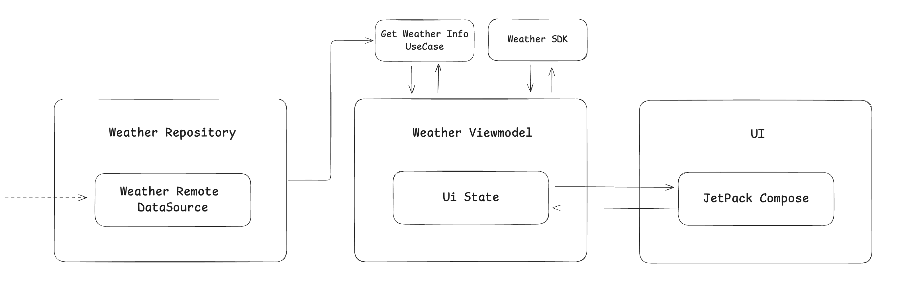

# Weather SDK

The Weather SDK is a powerful tool for integrating weather data into your Android application.

## Features

- Current Weather Data: Retrieve real-time weather information for any city, displayed on the Forecast Screen.
- Hourly Forecast: View an accurate hourly weather forecast for the next 24 hours, starting from the next full hour. For example, if the current time is 19:01, the first forecast hour displayed will be 20:00.

---

## Table of Contents

- [Installation](#installation)
- [Getting Started](#getting-started)
- [Listening for Events](#listening-for-events)
- [Event Types](#event-types)
- [Configuration](#configuration)
- [Error Handling](#error-handling)
- [Documentation](#documentation)
- [Architecture](#architecture)
- [License](#license)

---

## Installation

Add the Weather SDK dependency to your project. Replace `x.x.x` with the latest version:

```gradle
dependencies {
    implementation "com.github.Ahmed-Ganna:WeatherSdk:x.x.x"
}
```

---

## Getting Started

To use the Weather SDK, you need an API key for authentication.

### Step 1: Initialize the SDK

Create an instance of the `WeatherSDK` class by passing your API key.

```kotlin
val weatherSDK = WeatherSDK(apiKey = "YOUR_API_KEY")
```


### Step 2: Create a Weather Fragment

You can create a weather fragment using the `createFragment` method. Pass a configuration object containing the city name.

### Example:

```kotlin
val config = WeatherSDK.Config(cityName = "Berlin")
val weatherFragment = weatherSDK.createFragment(config)

// Add the fragment to your activity or fragment container
supportFragmentManager.beginTransaction()
    .replace(R.id.fragment_container, weatherFragment)
    .commit()
```

### Notes:
- The `cityName` parameter in the configuration must not be empty. An `IllegalStateException` will be thrown otherwise.

---

## Listening for Events

The SDK exposes an `eventsFlow` for handling events. Collect this flow to listen for SDK events.

### Example:

```kotlin
lifecycleScope.launch {
    weatherSDK.eventsFlow.collect { event ->
        when (event) {
            is WeatherSDK.WeatherSDKEvents.OnFinished -> {
                // Handle successful dismissal
                println("Weather fragment dismissed successfully")
            }
            is WeatherSDK.WeatherSDKEvents.OnFinishedWithError -> {
                // Handle error
                println("Error occurred: ${event.e.message}")
            }
        }
    }
}
```

---

## Event Types

The SDK emits the following event types:

1. **`OnFinished`**  
   Emitted when the user taps the back button, and the weather fragment is dismissed.

2. **`OnFinishedWithError`**  
   Emitted when an error occurs, and the weather fragment is dismissed.
   - **Property:** `e: Throwable` — The exception describing the error.

---

## Configuration

The `WeatherSDK.Config` class is used to define the configuration for the SDK.

### Properties:

| Property   | Type     | Description                           |
|------------|----------|---------------------------------------|
| `cityName` | `String` | The name of the city for weather data |

### Example:

```kotlin
val config = WeatherSDK.Config(cityName = "Berlin")
```

---

## Error Handling

- If the `cityName` parameter in the configuration is blank, an `IllegalStateException` will be thrown.
- Subscribe to the `eventsFlow` to handle errors using the `OnFinishedWithError` event.

---

## Documentation

You can build the Dokka documentation for the Weather SDK using the following command:

```bash
./gradlew weathersdk:dokkaHtml
```

The generated documentation can be found under `weathersdk/build/documentation`.

---

## Architecture



---

## License

This SDK is released under the [MIT License](LICENSE).

For support or further documentation, please contact our team at support@example.com.